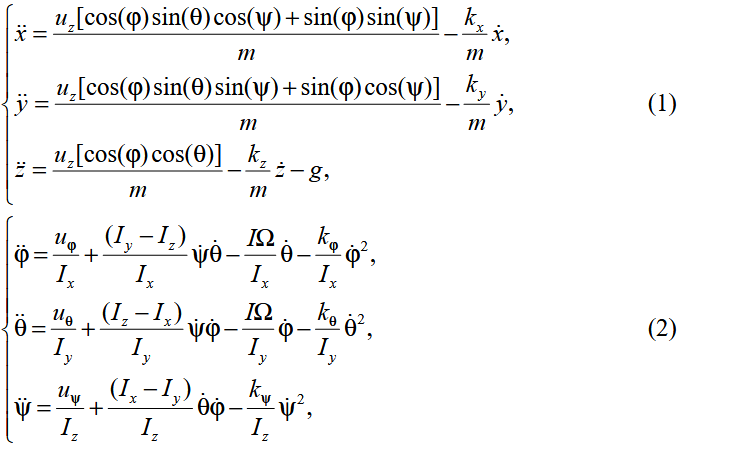
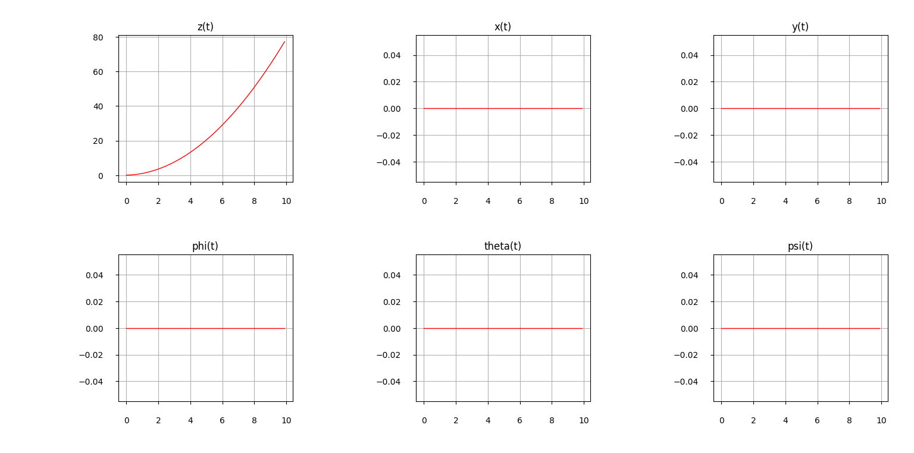
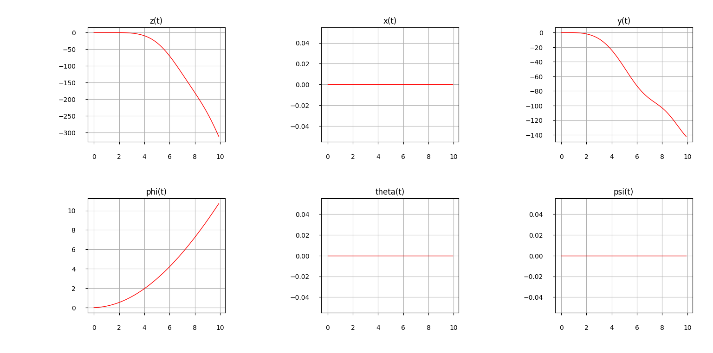

# Quadcopter-model
**The function used to simulate quadcopter dynamics. I made this when I was starting to learn python.**  
`dynamics.py` contains the function that simulates one step of numerical grid.  
`dynamics_example.py` provides an example of modeling the movement of the quadcopter.  
_Deteailed discription of the model and some control algorithms can be found in [this paper](https://doi.org/10.26160/2474-5901-2024-43-42-54) that I published with my scientific supervisor._  
Basicaly fuction simulates dynamics of this system of equations:  

## Setup
*Example provided in `dynamics_example.py` contains description of how to configurate numerical grid and set control input.*  
The function `dynamics` takes 4 inputs:  
> Ts (float): Timestep of your grid.  
> X (listlike): State vector of the previous step. Must be (12,1). See paper for stucture.  
> U (listlike): Input vector applied to the current step. Must be (6,1). See paper for stucture.  
> RealityCheck (bool): bool for cheking if the function used in simulation or control law synthesis.  
## Examples
For instance here is the outputs of the model given constant signal to the channel responsible for z coordinate:  
  
and if given constant signal to the channel responsible for $\phi$ coordinate:  
  
